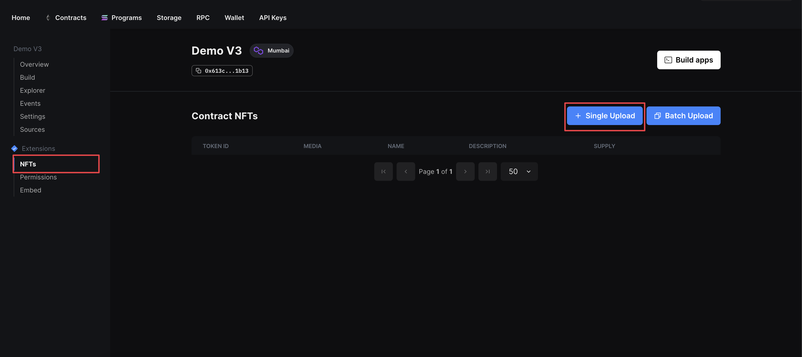
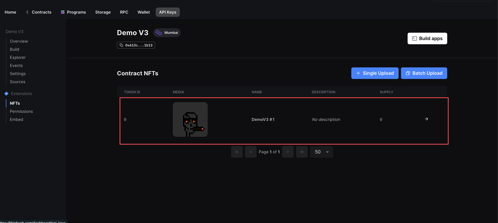

# Create an NFT-Gated Experience for Your Users

If you're looking to token-gate content to only be accessible by your NFT holders, you're in the right place. In this guide, I'll show you how to get this up & running in no time. We'll be using Typescript, TailwindCSS, and Next.js for this tutorial.

## Prerequisites

Before we start, make sure you have the following:

- Create a Paper developer account
- Install Node
- Have some funds on Polygon's Mumbai testnet (to deploy your smart contract)

## Getting Started

First let's set up our NFT project. Head to https://thirdweb.com/dashboard/contracts and create a new ERC1155 contract. It will be labeled as an "Edition Drop" on Thirdweb. Click "Deploy Now" and enter your NFT details. Deploy on Mumbai.

Once it's deployed, head to the NFT tab on the left side of your dashboard. Click "Single Upload" & enter the metadata for your NFT. 

Once you enter your metadata, click "Lazy Mint". Once your first NFT is minted, click on the NFT itself: 

There will be a tab that says "Claim Conditions". Select that & click the "Add Phase" button. Create a public claim phase. Fill out the rest of the details & submit your transaction to save this claim phase. 

Once the transaction is confirmed, copy the contract address & head over to https://withpaper.com/dashboard/contracts. Click "Register Contract", enter the name of your contract & change the chain to Mumbai. Paste your contract address and select "thirdweb Contract" for the contract type. It will automatically pull the ABI. Hit "Register".

After the contract is registered, create a shareable link and enter the necessary information. Once you save the link, make sure to copy the contract ID, contract address, & shareable link url. We'll need it in our code.


Next, let's set up our new project. Open a new project folder in VSCode & run 
```bash
npx create-next-app@latest .
```
to initialize a new project. The CLI will ask you a few questions, so enter: 
- "Yes" for Typescript
- "No" for ESLint
- "Yes" for TailwindCSS
- "No" for `src/` directory
- "Yes" for App Router
- "No" for customizing import alias.

Next, install the necessary packages:

```bash
npm i @paperxyz/embedded-wallet-service-rainbowkit @rainbow-me/rainbowkit wagmi ethers@^5 dotenv @thirdweb-dev/react @thirdweb-dev/sdk tailwindcss-animate encoding lokijs pino-pretty @paperxyz/js-client-sdk
```

In your `app/globals.css` file, replace the file with the following:
  
```css
@tailwind base;
@tailwind components;
@tailwind utilities;
```

In your `tailwind.config.js` file, replace the file with the following:

```js
const { fontFamily } = require("tailwindcss/defaultTheme");

/** @type {import('tailwindcss').Config} */
module.exports = {
  darkMode: ["class"],
  content: [
    "./pages/**/*.{js,ts,jsx,tsx,mdx}",
    "./components/**/*.{js,ts,jsx,tsx,mdx}",
    "./app/**/*.{js,ts,jsx,tsx,mdx}",
  ],
  theme: {
    extend: {
      colors: {
        "dark-main": "#262835",
        "dark-secondary": "#3b3f53",
        "dark-tertiary": "#525875",
        "dark-quaternary": "#6f77a2",
        "light-main": "#f6f7f9",
        "light-secondary": "#d5d7e2",
        "light-tertiary": "#868daa",
        "light-quaternary": "#676f90",
      },
      keyframes: {
        "accordion-down": {
          from: { height: 0 },
          to: { height: "var(--radix-accordion-content-height)" },
        },
        "accordion-up": {
          from: { height: "var(--radix-accordion-content-height)" },
          to: { height: 0 },
        },
      },
      animation: {
        "accordion-down": "accordion-down 0.2s ease-out",
        "accordion-up": "accordion-up 0.2s ease-out",
      },
    },
  },
  plugins: [require("tailwindcss-animate")],
};
```

Create a `.env` file and enter the following:

```env
NEXT_PUBLIC_CLIENT_ID="YOUR_CLIENT_ID"
NEXT_PUBLIC_CONTRACT_ADDRESS="YOUR_CONTRACT_ADDRESS"
NEXT_PUBLIC_SHAREABLE_LINK="YOUR_SHAREABLE_LINK"
```

Make sure to replace the values with the ones you saved earlier.

To make sure the logo works, create a file in `/public` called `paper.svg` and add the following: 

```svg
<svg width="20" height="38" viewBox="0 0 20 38" fill="none" xmlns="http://www.w3.org/2000/svg">
<path fill-rule="evenodd" clip-rule="evenodd" d="M20 7.07674C20 6.64095 19.7178 6.25534 19.3024 6.12356L0 0V9.14815L11.4286 12.6222L2.14286 19V26.7407L4.31239 28.986L2.46932 30.6655C2.26137 30.855 2.14286 31.1233 2.14286 31.4046V38L8.57143 33.0741V25.3333L6.64797 23.6691L20 15.4815V7.07674Z" fill="#19A8D6"/>
<path d="M20 7.07674C20 6.64095 19.7178 6.25534 19.3024 6.12356L0 0V9.14815L20 15.4815V7.07674Z" fill="#39D0FF"/>
<path d="M8.57143 25.3333L2.14286 19V26.7407L8.57143 33.0741V25.3333Z" fill="#39D0FF"/>
</svg>
```

## Setting up the Blog

Now we can get started adding the functionality to the code. First create a folder called `api` inside the `app` folder. Create a second folder called `blogPosts` within the `api folder`. Add a file inside `api/blogPosts` called `route.ts` and add the following code:
```ts
import { NextResponse, NextRequest } from "next/server";

export const GET = async (req: NextRequest, res: NextResponse) => {
  const realPosts = [
    {
      title: "How to Create and Update NFTs Programmatically Using the Paper API",
      description:
        "If you're looking to create and update an NFT contract programmatically, you're in the right place.",
    },
    {
      title: "New: Optimism Support for Checkouts & Embedded Wallets",
      description:
        "Hey folks! We're super excited to announce that we're integrating Optimism into our Checkouts and Wallets products.",
    },
    {
      title: "How to Create an NFT Collection With The Same Asset (Without Code)",
      description:
        "In this tutorial, we will walk you through the process of creating an NFT contract with a Paper, where all holders of the NFT will have the same image or asset",
    },
    {
      title: "Create a Simple App to Airdrop NFTs to Email or Wallet Addresses Using Paper",
      description:
        "This guide will show you create a simple app to airdrop NFTs, without setting up your own infrastructure",
    },
  ];

  try {
    return NextResponse.json({ data: realPosts }, { status: 200 });
  } catch (error) {
    console.log(error);
    return NextResponse.json(`First Error: ${error}`, { status: 500 });
  }
};
```

This is to secure your content from being accessed by non-NFT holders. You'll be querying this endpoint to get the posts once the frontend has validated that the user owns the NFT.

In `layout.tsx` replace the code with this:
```tsx
"use client";

import { useEffect, useState } from "react";
import { Inter } from "next/font/google";
import "./globals.css";
import "@rainbow-me/rainbowkit/styles.css";
import { ThirdwebProvider } from "@thirdweb-dev/react";
import { PaperEmbeddedWalletProvider } from "@paperxyz/embedded-wallet-service-rainbowkit";

const inter = Inter({
  weight: ["300", "400", "600", "700"],
  subsets: ["latin"],
});

const RootLayout = ({ children }: { children: React.ReactNode }) => {
  const [loading, setLoading] = useState(true);
  const clientId = process.env.NEXT_PUBLIC_CLIENT_ID!;

  useEffect(() => {
    setLoading(false);
  }, []);

  if (loading) {
    return (
      <html lang="en">
        <body className={`${inter.className} bg-dark-main text-light-main`}>
          <div>Loading...</div>
        </body>
      </html>
    );
  }

  return (
    <html lang="en">
      <body className={`${inter.className} bg-dark-main text-light-main`}>
        <PaperEmbeddedWalletProvider
          appName="Paper RainbowKit Provider Example"
          walletOptions={{
            clientId: clientId,
            chain: "Mumbai",
          }}
        >
          <ThirdwebProvider activeChain="mumbai">
            {/*  */}
            {children}
          </ThirdwebProvider>
        </PaperEmbeddedWalletProvider>
      </body>
    </html>
  );
};

export default RootLayout;

```

In `page.tsx`, replace the code with the following:

```tsx
"use client";

import Link from "next/link";
import { ThirdwebSDK } from "@thirdweb-dev/sdk";
import { useEffect, useState } from "react";
import { ConnectButton } from "@paperxyz/embedded-wallet-service-rainbowkit";
import { renderPaperCheckoutLink } from "@paperxyz/js-client-sdk";
import { useAccount } from "wagmi";

export type BlogPost = {
  title: string;
  description: string;
};

const dummyPosts: BlogPost[] = [
  {
    title: "Lorem Ipsum Dolor Sit Amet",
    description:
      "Consectetur adipiscing elit, sed do eiusmod tempor incididunt ut labore et dolore magna aliqua.",
  },
  {
    title: "Vestibulum Ante Ipsum Primis",
    description:
      "Faucibus orci luctus et ultrices posuere cubilia curae; Donec velit neque, auctor sit amet aliquam vel.",
  },
  {
    title: "Mauris Blandit Aliquet Elit",
    description:
      "Etiam erat velit, scelerisque in dictum non, consectetur eget mi. Vestibulum ante ipsum primis in faucibus.",
  },
  {
    title: "Cras Ultricies Ligula Sed",
    description:
      "Pellentesque elit eget gravida cum sociis natoque penatibus et magnis dis parturient montes, nascetur ridiculus mus.",
  },
];

/* ======================================
              Main Component
======================================= */
const HomePage = () => {
  const [loading, setLoading] = useState(true);
  const [hasNFT, setHasNFT] = useState(false);
  const [posts, setPosts] = useState<BlogPost[]>([]);

  // Thirdweb Stuff
  const sdk = new ThirdwebSDK("mumbai");
  const contractAddress = process.env.NEXT_PUBLIC_CONTRACT_ADDRESS!;
  const shareableLink = process.env.NEXT_PUBLIC_SHAREABLE_LINK!;
  const minimumBalance = 1;
  const erc1155TokenId = 0;

  const { address, connector } = useAccount({
    async onConnect({ address, connector, isReconnected }) {
      console.log("Connected", { address, connector, isReconnected });
      console.log("Connected");
    },
    onDisconnect() {
      console.log("Disconnected");
      setPosts([]);
      setHasNFT(false);
    },
  });

  useEffect(() => {
    const checkNFT = async () => {
      const contract = await sdk.getContract(contractAddress);

      if (address) {
        const balance = await contract.erc1155.balanceOf(address, erc1155TokenId);
        const isValid = balance.gte(minimumBalance);

        if (isValid) {
          const res = await fetch("/api/blogPosts");
          const posts = await res.json();
          setPosts(posts.data);
          setHasNFT(true);
        } else {
          setPosts([]);
          setHasNFT(false);
        }
      }
    };
    checkNFT();
  }, [address]);

  // Fixes Hydration Issues
  useEffect(() => {
    setTimeout(() => setLoading(false), 500);
  }, []);

  if (loading) return null;

  return (
    <div className="text-center">
      {/* Navbar */}
      <nav className="bg-dark-secondary px-4 py-2">
        <div className="flex items-center justify-between px-3 py-3">
          <div className="flex items-center">
            <Link href="/">
              
            </Link>
            <h1 className="ml-4 text-2xl font-semibold text-light-main">Paper</h1>
          </div>

          <ConnectButton />
        </div>
      </nav>

      {/* Header */}
      <h1 className="mt-12 text-3xl">Demo Blog</h1>

      {/* Blog Posts */}
      {hasNFT ? (
        <div className="mx-auto mb-10 mt-8 max-w-5xl bg-dark-main p-4 text-light-main">
          <div className="grid grid-cols-2 gap-4">
            {posts.map((post, index) => (
              <div key={index} className="min-h-[200px] rounded bg-dark-secondary p-4 text-left">
                <h2 className="mb-2 text-xl text-light-secondary">{post.title}</h2>
                <p className="mt-3 text-light-tertiary">{post.description}</p>
              </div>
            ))}
          </div>
        </div>
      ) : (
        <div className="mx-auto mb-10 mt-8 max-w-5xl bg-dark-main p-4 text-light-main">
          <div className="grid grid-cols-2 gap-4">
            {dummyPosts.map((post, index) => (
              <div key={index} className="min-h-[200px] rounded bg-dark-secondary p-4 text-left">
                <h2 className="mb-2 text-xl text-light-secondary blur-sm">{post.title}</h2>
                <p className="mt-3 text-light-tertiary blur-sm">{post.description}</p>
              </div>
            ))}
          </div>
        </div>
      )}

      {/* Buy NFT Button */}
      {!address ? null : hasNFT ? null : (
        <button
          onClick={() =>
            renderPaperCheckoutLink({
              checkoutLinkUrl: shareableLink,
            })
          }
          className="rounded bg-dark-tertiary px-5 py-3 transition-all hover:bg-dark-quaternary"
        >
          Buy with Paper
        </button>
      )}
    </div>
  );
};

export default HomePage;
```

Let's break down what's happening:
- In `layout.tsx`, we're adding the Paper & Thirdweb Providers to ensure that our entire app has access to the Paper & Thirdweb functionality. We also create a loading state to ensure the app fully renders properly.
- In `page.tsx` we first set up the state variables. 
  - `useAccount` allows us to track wallet changes & disconnections, which help us know when we should show the real content vs the placeholder content. 
  - The first `useEffect` hook tracks when the address changes and checks to see if the account holds the necessary NFT. If it doesn't, it will render the blurred data, but if it does, it will call our backend and fetch the real posts & update our frontend.
  - When the user clicks "Buy", they will be navigated to a checkout drawer to purchase the NFT. Once the purchase is complete, they can reload the page & get access to the content with their wallet that owns the NFT. They can use an email & credit card, or an external wallet like Metamask


Save the files & open your terminal. Run `npm run dev` and you'll be up & running!